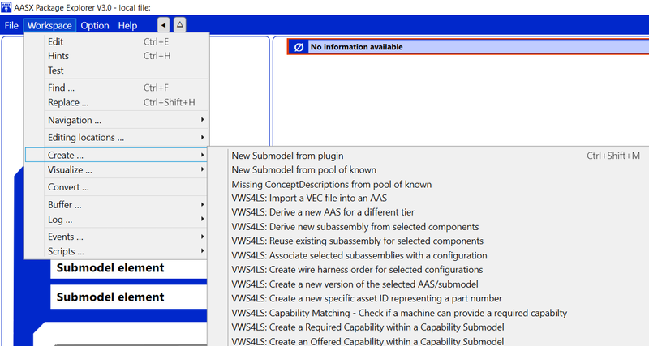

# vws4ls-aaspe-plugin

A plugin for the [Eclipse AASX Package Explorer<small>TM</small>](https://github.com/eclipse-aaspe/package-explorer) (*AASPE*) demonstrating various results from the research project [Asset Administration Shell for the Wiring Harness](https://arena2036.de/en/asset-administration-shell-for-wire-harness) (*VWS4LS*) funded by the German Federal Ministry of Education and Research.

A detailed description of the results of the various subprojects can be found [here](https://arena2036.de/de/vws4ls-ergebnisse) (German only).

## Installation

- Download a current release of the *AASPE* from [https://github.com/eclipse-aaspe/package-explorer/releases](https://github.com/eclipse-aaspe/package-explorer/releases). This plugin was tested against version *v2024-06-10.alpha* but newer releases should also work unless there are major changes in the plugin architecture.
- Refer to the readme of *AASPE* for installation instructions.
- Download the latest release of this plugin from the [releases](https://github.com/de-ich/vws4ls-aaspe-plugin/releases).
- Unzip the contents of the plugin to the `plugins` folder of you *AASPE* installation.
- Note: After that, your `plugins` folder should contain a folder `AasxPluginVws4ls`.

## Debugging

- Clone this repository
- Build the project
- Make sure that your version of *AASPE* uses exactly the same version of the built plugin code, by
  - copying the build results to the plugin folder of *AASPE* as described in the installation section above,
  - creating a symlink from the plugin folder of *AASPE* to your build output folder, or
  - adjust the file `AasxPackageExplorer.options.json` of your *AASPE* to include the build output folder.
- Start *AASPE*
- Attach the debugger to the running *AASPE* process, e.g. by selecting `Debug -> Attach to process...` in Visual Studio

## General Usage

This plugin adds several actions to the *AASPE*. After completing the steps described in the *Installation* section and starting the *AASPE*, these actions should be available via `Workspace -> Create...` as shown in the following screenshot:

## Core Concepts

This section introduces several core concepts required to understand the functionality of the provided actions:

### Linking of equivalent AASes/assets

*VWS4LS* introduces the concept of *equivalent assets/asset administration shells* between different companies. For example, a Tier2 company provides a component used by an OEM. However, both identify these components differently (using their own interal identification system) and both keep their own data sets describing the component. When the OEM first "imports" a new component (e.g. into its own PLM system), the data provided by the Tier2 usually serves as a starting point.

Specific asset IDs are a concept to attach one or multiple IDs to an AAS. Thereby, each of these IDs can be given a *name*, *semanticID* and a *subjectID* to describe the context and meaning of this ID. An example for this is a *part number* (identified via the *semanticID*) in the classification system of a certain company (identified via the *subjectID*).

By copying such a *specific asset ID* from one AAS to a second AAS, an *equivalence* link is formed.
This can for example be used for mapping part numbers between different companies/classification systems, e.g. when "importing" components from supplies as explained above.

### Description of complex product structures

In *VWS4LS*, a concept to describe the structure of a complex product by means of several *BOMs* (bills of material) was developed:
1. The *Product_BOM* describes the simple components that a product is composed of.
2. The *Manufacturing_BOM* describes the parts that are required to produce the product - this can be either simple components or sub-assemblies.
3. The *Configuration_BOM* describes several configuration variants of the product.

Note: All mentioned *BOMs* are realized based on the IDTA submodel template *Hierarchical Structures enabling Bills of Material* (see [https://industrialdigitaltwin.org/en/content-hub/submodels](https://industrialdigitaltwin.org/en/content-hub/submodels)).

Note: The *SameAs* relationship described in the submodel template is used to interlink the different hierarchies.

This structure can be used for different types of products, e.g. a complete wire harness or a small subassembly based on a single component. Within the various *BOMs*, each element can point to its own asset/AAS thereby creating a linked network of AASes that iteratively describes how a product is manufactured.

### Versioning Concept

*VWS4LS* describes a versioning concept where each version of a product specification is represented by a new AAS (representing the same asset). This enables the possibility to maintain different versions of a product specification and provide simple access to all versions simultaneously, e.g. via a single AAS repository.

The same concept applies to changed submodels, i.e. a new (clone) of a submodel is created for each new version. However, not every submodel necessarily needs to be updated when creating a new AAS version. This is e.g. the case when a new version only affects a certain submodel. This means that a new (version of an) AAS can also refere to submodels included by an older version of the same AAS.

In order to provide the possibility of building a version history, each AAS refers to the previous version, i.e. the AAS it has been derived from. This is realized by adding a custom *Extension* element to the new AAS that includes the relevant reference to the previous AAS version.

### Modeling of required/offered capabilities

In *VWS4LS*, a concept for modeling of capabilities was developed based on an interim version of the IDTA submodel *Capability Description* (see [https://industrialdigitaltwin.org/en/content-hub/submodels](https://industrialdigitaltwin.org/en/content-hub/submodels)). The concept covers both the modeling of capabilities required to produce a certain product as well as of capabilities provided by a resource.

The concept explicitly covers the possibility to model capabilities as a result of combining a machine with a tool.

Ontop of the basic concept, a set of capabilities and associated parameters was developed in *VWS4LS*. The set of capabilities thereby covers the most relevant processes used in the production of wire harnesses.

## Provided Actions

### VWS4LS: Import a VEC file into an AAS

The *Vehicle Electric Container* (VEC, see [https://ecad-wiki.prostep.org/specifications/vec/](https://ecad-wiki.prostep.org/specifications/vec/)) is specification that allows to create a detailed product model of a wire harness that can - among others - be serialized as XML. To incorporate such a product specification into the AAS ecosystem, the plugin provides the action `Import a VEC file into an AAS`.

This will
- create two submodels *Product_BOM* and *Configuration_BOM* (cf. [Description of complex product structures](#description-of-complex-product-structures)) that describe the components and configurations that the wire harness represented by the VEC file consists of and
- create a *ProductSpecification* submodel that
  - imports the VEC file and
  - creates several links between the elements from the new *Product_BOM* and *Configuration_BOM* submodels and the elements within the VEC file.

To execute the action, follow the following steps:
- Select an existing AAS
- Execute`Workspace -> Create... -> VWS4LS: Import a VEC file into an AAS`
- Select the VEC file to be imported

### VWS4LS: Derive a new AAS for a different tier

To support the workflow of importing data from an existing AAS and creating an equivalent AAS under one's own ownership (see [Linking of equivalent AASes/assets](#linking-of-equivalent-aasesassets)), the plugin provides the action `Derive a new AAS for a different tier`. 

This will create a new AAS that contains
- a *specific asset ID* representing the part number of the asset from an existing AAS in order to create a link to this original asset and the associated AAS
- a *specific asset ID* representing the part number of the new asset
- a deep copy of all submodels from the existing AAS

To execute the action, follow the following steps:
- Select an existing AAS in the *AASPE*
- Execute `Workspace -> Create... -> VWS4LS: Derive a new AAS for a different tier`
- Fill in the required fields in the dialog
    - Name of the Derived AAS: The name of the new AAS to be created
    - Part Number for the Derived Asset: The part number of the asset represented by the new AAS in the identification system of the "new" company, e.g. `123456789`
    - Subject ID for the derived AAS: The `subject ID` of the company you want to derive a new AAS for (this should be a valid URL uniquely identifying the company, e.g. `https://www.my-company.com`)

### VWS4LS: Derive new subassembly from selected components

When a product is designed, it can be described by a list of required components. Based on this list of components, available machinery and other factors, the manufacturing process is developed. One main question to be answered during this development is the design of the different production steps and the resulting subassemblies (cf. [Description of complex product structures](#description-of-complex-product-structures)). To support this iterative derivation of subassemblies, the plugin provides the action `Derive new subassembly from selected components`. 

This will
- create an AAS for the new subassembly with all required submodels
- modify the *Manufacturing BOM* of the existing AAS containting the selected entities to incorporate the new subassembly

To execute the action, follow the following steps:
- Select one or multiple entities from a *Product BOM* for an existing product/subassembly
- Execute `Workspace -> Create... -> VWS4LS: Derive new subassembly from selected components`
- Fill in the required fields in the dialog
    - Name of subassembly instance in the manufacturing BOM of existing AAS
    - Name of subassembly AAS to be created
- Additionaly, for each selected entity, the dialog provides the option to set a (different) name that will be used to represent this entity in the new AAS    

### VWS4LS: Reuse existing subassembly for selected components

Similarly to the workflow describes in [Derive new subassembly from selected components](#derive-new-subassembly-from-selected-components), there is also the possibility to reuse existing subassemblies when developing a new product. To support this, the plugin provides the action `Reuse existing subassembly for selected components`. 

Instead of creating a new AAS, it will
- reuse an existing AAS describing a subassembly
- modify the *Manufacturing BOM* of the existing AAS containting the selected entities to incorporate the existing subassembly

To execute the action, follow the following steps:
- Select one or multiple entities from the *Product BOM* of an existing product/subassembly
- Execute `Workspace -> Create... -> VWS4LS: Reuse existing subassembly for selected components`
- Fill in the required fields in the dialog
    - Name of subassembly instance in the manufacturing BOM of existing AAS
    - Subassembly AAS to Reuse: Select an existing AAS representing a subassembly
- Based on the selected existing subassembly, configure a mapping between the components within the two AASes

### VWS4LS: Associate selected subassemblies with a configuration

*Configurations* represent variants of a complex product and are represented in the *Configuration_BOM* (see [Description of complex product structures](#description-of-complex-product-structures)). Each configuration is represented by a (sub-)set of subassemblies that it includes. In order to create these associations between configuration and subassemblies, the plugin provides the action `Associate selected subassemblies with a configuration`.

To execute the action, follow the following steps:
- Select one or multiple entites from the *Manufacturing BOM* of an existing product
- Execute `Workspace -> Create... -> VWS4LS: Associate selected subassemblies with a configuration`
- Fill in the required fields in the dialog
    - Configuration to associate with selected subassemblies: An existing configuration from the *Configuration BOM* of the existing product

### VWS4LS: Create wire harness order for selected configurations

During product development, a linked network of AASes describing products, subassemblies and components is created (see [Description of complex product structures](#description-of-complex-product-structures)). All these AASes represent *types*.

After the development is finished, actual product *instances* are created which are also represented by there own AASes. To initialize such an AAS representing a product instance to be produced, the plugin provides the action `Create wire harness order for selected configurations`.

To execute the action, follow the following steps:
- Select one or multiple entites from the *Configuration BOM* of an existing product
- Execute `Workspace -> Create... -> VWS4LS: Create wire harness order for selected configurations`
- Fill in the required fields in the dialog
    - Order Number: The order number for the production order

### VWS4LS: Create a new version of the selected AAS/submodel

In order to support the creation of new AAS/submodel versions as described in [Versioning Concept](#versioning-concept), the plugin provides the action `Create a new version of the selected AAS/submodel`.

This will create a new version of an existing AAS/submodel and automatically set the reference to the previous version. In case an AAS is selected, the new version of the AAS will reference the same (old) versions of the submodels referenced by the old version of the AAS. New versions of the required (i.e. changed) submodels can be created afterwards using the same plugin action.

To execute the action, follow the following steps:
- Select either an AAS or a submodel
- Execute `Workspace -> Create... -> VWS4LS: Create a new version of the selected AAS/submodel`
- Fill in the required fields in the dialog
    - Version: The version number to be set for the new AAS/submodel
    - (if a submodel was selected) Delete (reference to) old version: Delete a reference to the old version of the submodel from the AAS (i.e. replace the existing submodel reference)

### VWS4LS: Create a new specific asset ID representing the part number

As described in [Linking of equivalent AASes/assets](#linking-of-equivalent-aasesassets), specific asset IDs representing the part number of an asset are the basis for describing equivalences between different assets.

To create such an asset ID, the plugin provides the action `Create a new specific asset ID representing the part number`.

To execute the action, follow the following steps:
- Select an AAS
- Execute `Workspace -> Create... -> VWS4LS: Create a new specific asset ID representing the part number`
- Fill in the required fields in the dialog
    - Subject IDS: The `subject ID` of the company owning this AAS (this should be a valid URL uniquely identifying the company, e.g. `https://www.my-company.com`)
    - Part Number: The part number of the asset represented by this AAS according to the identification system of the company, e.g. `123456789`

### VWS4LS: Capability Matching - Check if a machine can provide a required capability

To check if a machine offers a certain capability required to produce a product, the plugin provides the action ` Capability Matching - Check if a machine can provide a required capability`.

To execute the action, follow the following steps:
- Select a required capability, i.e. a *CapabilityContainer* that is part of a *RequiredCapabilities* submodel.
- Execute `Workspace -> Create... -> VWS4LS: Capability Matching - Check if a machine can provide a required capability`
- Fill in the required fields in the dialog
    - Machine AAS to Check: Select an available AAS representing a machine. This AAS should provide an *OffereCapabilities* submodel.
 
This will check if the machine (potentially with the help of a required tool) is able to fulfill the required capabilities. The result of this check is written to the log output of *AASPE* which can be opened at the bottom right corner of the window.

### VWS4LS: Create a Required Capability within a Capability Submodel

To create a new required capability based on the list of capabilities and associated parameters defined during *VWS4LS* (see [Modeling of required/offered capabilities](#modeling-of-requiredoffered-capabilities)), the plugin provides the action `Create a Required Capability within a Capability Submodel`.

To execute the action, follow the following steps:
- Select a *RequiredCapabilities* submodel
- Execute `Workspace -> Create... -> VWS4LS: Create a Required Capability within a Capability Submodel`
- Fill in the required fields in the dialog
    - Required Capability: Select one of the capabilities defined as part of *VWS4LS*
    - According to the selected capabilities, fill the properties with required values
    - Properties that are not important can be left blank

Within the selected submodel, this will create a new *CapabilityContainer*, including the actual *Capability* as well as all *Properties* and the specified values.

### VWS4LS: Create an Offered Capability within a Capability Submodel

To create a new offered capability based on the list of capabilities and associated parameters defined during *VWS4LS* (see [Modeling of required/offered capabilities](#modeling-of-requiredoffered-capabilities)), the plugin provides the action `Create an Offered Capability within a Capability Submodel`.

To execute the action, follow the following steps:
- Select an *OfferedCapabilities* submodel
- Execute `Workspace -> Create... -> VWS4LS: Create an Offered Capability within a Capability Submodel`
- Fill in the required fields in the dialog
    - Offered Capability: Select one of the capabilities defined as part of *VWS4LS*
    - According to the selected capabilities, fill the properties with required values
    - Each value represents a constraint for the given properties
    - Depending on the property, enter either a fixed value, a list of values seprated by `;` or a range where the lower and upper bound is separated by a `;`
    - Properties that are not constrained by the resource can be left empty

Within the selected submodel, this will create a new *CapabilityContainer*, including the actual *Capability* as well as all *Properties* and the specified value constraints.

